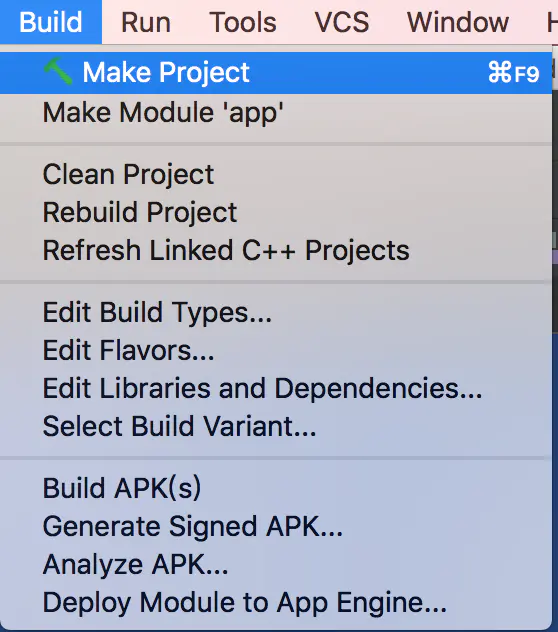

# Android JNI学习(二) 实战 JNI 之 “hello world”

本节内容主要简介如下：

·    1、环境展示

·    2、传统方式的具体流程

·    3、传统方式的相关问题

·    4、传统方式的so文件

·    5、通过CMake工具demo演示流程

·    6、CMake工具demo的背后原理

·    7、CMake的应用

·    8、使用experimental-plugin插件编译

 


 

 


## **一、环境展示**

操作系统为:


 

Android Studio版本为：


NDK环境: 


模拟器为:


## **二、传统方式的具体流程**

具体流程如下：

**(一)创建项目**

首先在Android Studio创建一个Android项目，包名为`com.lsx.ndkdemo`

**(二) 创建引用本地库的工具类**

然后创建一个class为NDKTools, 代码如下：

```
package com.lsx.ndkdemo;

public class NDKTools {
    public static native String getStringFromNDK();
}

```


**(三)在界面上添加一个按钮，在点击事件中调用NDKTools的getStringFromNDK()方法**

```
String text = NDKTools.getStringFromNDK();
Log.d("test", text);
```


**(四)获取classes文件**

在Android Studio中点击Build中的Make Project或者Rebuild Project进行编译来获取中间文件。如下图




 编译完成后，我们就可以获取class文件如下图


**(五)进入相应目录**

点击Android Studio下面的Terminal，然后跳到`ndkdemo/app/build/intermediates/javac/debug/classes`下(其中NDKDemo为是项目的根目录)，在Terminal执行pwd确认目录。

**(六) 获取.h文件**

在`/Users/apple/Desktop/ndkdemo/app/build/intermediates/javac/debug/classes`下执行下面的命令`javah -jni com.lsx.ndkdemo.NDKTools`。如果没有问题，则会在`/Users/apple/Desktop/ndkdemo/app/build/intermediates/javac/debug/classes`下面生成`com_lsx_ndkdemo_NDKTools.h`文件。如下图


其内容如下：

```
/* DO NOT EDIT THIS FILE - it is machine generated */
#include <jni.h>
/* Header for class com_lsx_ndkdemo_NDKTools */

#ifndef _Included_com_lsx_ndkdemo_NDKTools
#define _Included_com_lsx_ndkdemo_NDKTools
#ifdef __cplusplus
extern "C" {
#endif
/*
 * Class:     com_lsx_ndkdemo_NDKTools
 * Method:    getStringFromNDK
 * Signature: ()Ljava/lang/String;
 */
JNIEXPORT jstring JNICALL Java_com_lsx_ndkdemo_NDKTools_getStringFromNDK
  (JNIEnv *, jclass);

#ifdef __cplusplus
}
#endif
#endif

```


如下图


**(七)增加对应的.c文件**

在工程main目录下创建一个名字为jni目录，然后将刚才的.h文件剪切过来。在jni目录下新建一个c文件。命名为ndkdemotest.c。此时项目目录如下：


**(八)编写ndkdemotest.c文件**

将ndkdemotest.c协商如下内容

```
//
// Created by apple on 2022/12/28.
//

#include "com_lsx_ndkdemo_NDKTools.h"

JNIEXPORT jstring JNICALL Java_com_lsx_ndkdemo_NDKTools_getStringFromNDK(JNIEnv *env, jobject obj) {

   return (*env)->NewStringUTF(env, "Hello World，这是隔壁老李头的NDK的第一行代码");

}
```


内容不多，就是两部分，第一部分就是 添加`com_lsx_ndkdemo_NDKTools.h`头文件，然后就是具体实现`Java_gebilaolitou_ndkdemo_NDKTools_getStringFromNDK`函数


**(九)添加并编写Android.mk文件**

同样在jni目录下，添加一个Android.mk文件，其目录结构如下：


同样在Android.mk文件里面编写如下内容

```
LOCAL_PATH := $(call my-dir)

include $(CLEAR_VARS)

LOCAL_MODULE  := ndkdemotest-jni

LOCAL_SRC_FILES := ndkdemotest.c

include $(BUILD_SHARED_LIBRARY)
```


关于Android.mk语言后面会单独写一篇文章进行讲解，这里重点说上面代码的内容

LOCAL_PATH := $(call my-dir)：每个Android.mk文件必须以该定义开始。它用于在开发tree中查找源文件。宏my-dir则由Build System 提供。返回包含Android.mk目录路径。

include $(CLEAR_VARS) ：CLEAR_VARS变量由Build System提供。并指向一个指定的GNU Makefile，由它负责清理很多LOCAL_xxx。例如LOCAL_MODULE，LOCAL_SRC_FILES，LOCAL_STATIC_LIBRARIES等等。但不是清理LOCAL_PATH。这个清理是必须的，因为所有的编译控制文件由同一个GNU Make解析和执行，其变量是全局的。所以清理后才能避免相互影响。

LOCAL_MODULE := ndkdemotest-jni：LOCAL_MODULE模块必须定义，以表示Android.mk中的每一个模块。名字必须唯一且不包含空格。Build System 会自动添加适当的前缀和后缀。例如，demo，要生成动态库，则生成libdemo.so。但请注意：如果模块名字被定义为libabc，则生成libabc.so。不再添加前缀。

LOCAL_SRC_FILES := ndkdemotest.c：这行代码表示将要打包的C/C++源码。不必列出头文件，build System 会自动帮我们找出依赖文件。缺省的C++ 源码的扩展名为.cpp。

include $(BUILD_SHARED_LIBRARY)：BUILD_SHARED_LIBRARY是Build System提供的一个变量，指向一个GUN Makefile Script。它负责收集自从上次调用include $(CLEAR_VARS)后的所有LOCAL_xxx。并决定编译什么类型

·    BUILD_STATIC_LIBRARY：编译为静态库

·    BUILD_SHARED_LIBRARY：编译为动态库

·    BUILD_EXECUTABLE：编译为Native C 可执行程序

·    BUILD_PREBUILT：该模块已经预先编译


PS:这里不编写Android.mk会提示如下问题：

```
Error:Execution failed for task ':app:compileDebugNdk'.

\> Error: Flag android.useDeprecatedNdk is no longer supported and will be removed in the next version of Android Studio. Please switch to a supported build system.

 Consider using CMake or ndk-build integration. For more information, go to:

  https://d.android.com/r/studio-ui/add-native-code.html#ndkCompile

  To get started, you can use the sample ndk-build script the Android

  plugin generated for you at:

  /Users/gebilaolitou/AndroidStudioProjects/JNIDemo/app/build/intermediates/ndk/debug/Android.mk

 Alternatively, you can use the experimental plugin:

  https://developer.android.com/r/tools/experimental-plugin.html

 To continue using the deprecated NDK compile for another 60 days, set 

 android.deprecatedNdkCompileLease=1523001628930 in gradle.properties
```

全是英文，简单的翻译下如下：

```
错误：执行app:compileDebugNdk任务失败
 错误：不再支持android.useDeprecatedNdk标志，并且将会在未来的Android Studio版本中删除这个标志。请切换到CMake构建系统或者ndk-build中集成。更多的信息请参考https://d.android.com/r/studio-ui/add-native-code.html#ndkCompile。您可以使用Android的示例ndk-build脚本在以下位置生成的插件：
 /Users/gebilaolitou/AndroidStudioProjects/JNIDemo/app/build/intermediates/ndk/debug/Android.mk。

另外，你也可以使用实验性插件[https://developer.android.com/r/tools/experimental-plugin.html](https://link.jianshu.com/?t=https%3A%2F%2Fdeveloper.android.com%2Fr%2Ftools%2Fexperimental-plugin.html)
 如果你还想继续再使用已经被弃用的NDK编译60天，你需要再gradle.properties中设置android.deprecatedNdkCompileLease=1523001628930

因为以上原因，所以我们需要设置Android.mk
```


**(十)修改相应的配置文件**

**首先**检查local.properties文件中是否有NDK路径，如果有没有NDK路径，则添加NDK路径，比如我的如下：

```
sdk.dir=/Users/apple/Library/Android/sdk
ndk.dir=/Users/apple/Library/Android/sdk/ndk/23.1.7779620
```

**其次**修改app module目录下的build.gradle中的内容，如下：

```
apply plugin: 'com.android.application'

android {

  compileSdkVersion 26

  defaultConfig {

    applicationId "gebilaolitou.ndkdemo"

    minSdkVersion 19

    targetSdkVersion 26

    versionCode 1

    versionName "1.0"

    testInstrumentationRunner "android.support.test.runner.AndroidJUnitRunner"

 

    ndk {
      moduleName "ndkdemotest-jni"
      # abiFilters "armeabi", "armeabi-v7a", "x86"
      abiFilters "x86", "arm64-v8a"
    }

  }

  buildTypes {

    release {

      minifyEnabled false

      proguardFiles getDefaultProguardFile('proguard-android.txt'), 'proguard-rules.pro'

    }

    externalNativeBuild {
      ndkBuild {
        path 'src/main/jni/Android.mk'
      }
    }

    sourceSets.main {
      jni.srcDirs = []
      jniLibs.srcDirs = ['src/main/jniLibs']
    }

  }

}
```


这样就有了so文件(此时还没生成so文件)

**(十一) 修改引用类**

**最后**在NDKTools类中添加静态初始化代码，如下：

```
public class NDKTools {
  static {
    System.loadLibrary("ndkdemotest-jni");
  }
  public static native String getStringFromNDK();
}
```


最后run一下即可，如下图

 


**三、传统方式的相关问题**

有的同学在运行的时候，会报如下错误：

Error:Execution failed for task ':app:compileDebugNdk'.

\> Error: Your project contains C++ files but it is not using a supported native build system.

 Consider using CMake or ndk-build integration. For more information, go to:

  https://d.android.com/r/studio-ui/add-native-code.html

 Alternatively, you can use the experimental plugin:

  https://developer.android.com/r/tools/experimental-plugin.html

首先把检查你项目中gradle.properties文件后面加上一句

Android.useDeprecatedNdk=true 

**四、传统方式的****so****文件**

大家可能会有疑问，那so去哪里了，我们平时使用第三方的sdk的so的时候，会要粘贴复制到项目里面，而我们上所述整个过程，并没有出现.so这个文件，那么这个.so去哪里了？

其实Android Studio自动帮我们把so放到apk里面，如果我们想找也能找到，如下图：

 


上面这套方式是传统的Android Studio的模式，那有没有更简单的方式，是有的，那下面我们就继续来看下

**五、通过****CMake****工具****demo****演示流程**

**(****一****)** **首先确保你本地有****CMake****，我们来看下****SDK Tools**


 

上面看到第三个 CMake 我本地没有，所以我要进行安装

**(****二****)** **勾选****Include C++ Support****复选框。**

在向导的 Configure your new project 部分，选中 Include C++ Support 复选框。
 如下图

 


勾选.png

这里有个坑，就是有好多同学说我没有这个Include C++ Support复选框，这是因为Android Studio设计的**"bug"**，你把这个对话框进行拉大，就出现了，因为一般的Android 项目用不到，所以在设计这个的时候，如果不特意的拉大，就选择性的"隐藏"了,太JB坑了。

然后一直下一步，直到Customize C++ Support部分

**(****三****)** **Customize C++ Support****的自定义项目**

如下：

 


模式.png

里面有个三个项目

·    **C++ Standard**：即C++标准，使用下拉列表选择你希望使用的C++的标准，选择Toolchain Default 会使用默认的CMake设置。

·    **Exceptions Support**：如果你希望启用对C++异常处理的支持，请选择此复选框。如果启动此复选框，Android Studio 会将-fexceptions标志添加到模块级build.gradle文件的cppFlags中，Gradle会将其传递到CMake。

·    **Runtime Type Information Support**：如果开发者希望支持RTTI，请选中此复选框。如果启用此复选框，Android Studio 会将-frtti标志添加到模块级build.gradle文件的cppFlags中，Gradle会将其传递到CMake。

最后点击 Finish。

**(****四****)** **检查** **Android** **目录**

在Android Studio 完成新项目的创建后，请从IDE左侧打开Project 矿口并选择Android 视图。如下图所示，Android Studio 将添加cpp和External Build Files 组：


Android模式.png

该图为开发者的原生源文件和外部构建脚本的Android 视图组。

PS：(此视图无法反应磁盘上的实际文件层次结构，而是将相似文件分到一组中，简化项目导航)。如果为Project模式则如下：


Project模式.png

那我们简单介绍下这两个多出来的文件夹：

·    在 **cpp** 文件夹中：可以找到属于项目的所有原生源文件等构建库。对于新项目，Android Studio会创建一个示例C++源文件 native-lib.cpp，并将其置于应用模块src/main/cpp/目录中。这个示例代码提供了一个简单的C++函数stringFromJNI()，此函数可以返回字符串**“Hello from C++”**

·    在 **External Build Files** 文件夹中：可以找到CMake或 ndk-build 的构建脚本。与build.gradle文件指示Gradle构建应用一样，CMake和ndk-build需要一个构建脚本来了解如何构原生库。对于新项目，Android Studio 会创建一个CMake 构建脚本CMakeLists.txt，并将其置于模块根目录中。

**(****五****)** **直接运行项目**

我们来直接 run一下这个项目，看下结果

 


结果1.png

**(****六****)** **修改****native-lib.cpp**

这时候我们修改下native-lib.cpp，native-lib.cpp内容如下：


native-lib.cpp内容.png

再直接run一下项目，看下结果。如下：

 


结果2.png


我们看到对应的文字已经修改了

**六、****CMake****工具****demo****的背后原理**

我们看打了，我们什么都没做，就自动实现了C++的实现，它的背后原理是什么那？我们大家就思考一下？

**(****一****)CMake****的入口**

它既然可以跑起来，一定有一个入口，那这个入口在哪里那?

 

先和大家说下我是怎么想象的，首先我们在点击Android Studio中的run按钮的时候，它是执行Gradle来进行打包的，所以说关于CMake的是怎么植入进去的，一定在项目的build.gradle，有相应的入口。

通过上面的思想，我们能举一反三得到什么？对的，就是类似于这种操作，一般都是在build.gradle里面实现的，因为在目前Android Studio就是通过Gradle是实现的

那我们就来看下它的build.gradle里面的代码，如下：

apply plugin: 'com.android.application'

 

android {

  compileSdkVersion 26

  defaultConfig {

​    applicationId "gebilaolitou.cmakendkdemo"

​    minSdkVersion 23

​    targetSdkVersion 26

​    versionCode 1

​    versionName "1.0"

​    testInstrumentationRunner "android.support.test.runner.AndroidJUnitRunner"

​    externalNativeBuild {

​      cmake {

​        cppFlags ""

​      }

​     }

  }

  buildTypes {

​    release {

​      minifyEnabled false

​      proguardFiles getDefaultProguardFile('proguard-android.txt'), 'proguard-rules.pro'

​    }

  }

  externalNativeBuild {

​    cmake {

​      path "CMakeLists.txt"

​    }

  }

}

 

dependencies {

  implementation fileTree(dir: 'libs', include: ['*.jar'])

  implementation 'com.android.support:appcompat-v7:26.1.0'

  implementation 'com.android.support.constraint:constraint-layout:1.0.2'

  testImplementation 'junit:junit:4.12'

  androidTestImplementation 'com.android.support.test:runner:1.0.1'

  androidTestImplementation 'com.android.support.test.espresso:espresso-core:3.0.1'

}

和我们平时搭建的项目差不多，就是多出来一块内容，**externalNativeBuild**。那这里我们重点说下**externalNativeBuild**

**(****二****) externalNativeBuild**

我们在build.gradle里面看到，有两个地方用到了externalNativeBuild，一个是在defaultConfig里面，是一个是在defaultConfig外面。

·    在defaultConfig外面的externalNativeBuild里面的cmake指明了CMakeList.txt的路径(在本项目下，和是build.gradle在同一个目录里面)。

·    在defaultConfig里面的externalNativeBuild里面的cmake主要填写的是CMake的命令参数。即由arguments中的参数最后转化成一个可执行的CMake的命令，可以在

defaultConfig外面的 externalNativeBuild - cmake，指明了 CMakeList.txt 的路径；
 defaultConfig 里面的 externalNativeBuild - cmake，主要填写 CMake 的命令参数。即由 arguments 中的参数最后转化成一个可执行的 CMake 的命令，可以在 app/externalNativeBuild/cmake/debug/{abi}/cmake_build_command.txt中查到。如下
 路径位置如下图：


路径.png

内容如下：

arguments : 

-H/Users/gebilaolitou/Desktop/codeLib/CMakeNDKDemo/app

-B/Users/gebilaolitou/Desktop/codeLib/CMakeNDKDemo/app/.externalNativeBuild/cmake/debug/x86

-DANDROID_ABI=x86

-DANDROID_PLATFORM=android-23

-DCMAKE_LIBRARY_OUTPUT_DIRECTORY=/Users/gebilaolitou/Desktop/codeLib/CMakeNDKDemo/app/build/intermediates/cmake/debug/obj/x86

-DCMAKE_BUILD_TYPE=Debug

-DANDROID_NDK=/Users/gebilaolitou/Library/Android/sdk/ndk-bundle

-DCMAKE_CXX_FLAGS=

-DCMAKE_TOOLCHAIN_FILE=/Users/gebilaolitou/Library/Android/sdk/ndk-bundle/build/cmake/android.toolchain.cmake

-DCMAKE_MAKE_PROGRAM=/Users/gebilaolitou/Library/Android/sdk/cmake/3.6.4111459/bin/ninja

-GAndroid Gradle - Ninja

jvmArgs : 

更多的可以填写的命令参数和含义可以参见[Android NDK-CMake文档](https://link.jianshu.com/?t=https%3A%2F%2Fdeveloper.android.com%2Fndk%2Fguides%2Fcmake.html)

ok上面既然提到了CMakeLists.txt，那我们就来看下CMakeLists.txt

**(****三****) CMakeLists.txt**

CMakeLists.txt这个文件主要定义了哪些文件需要编译，以及和其他库的关系等，那让我们来看下我们项目中的CMakeLists.txt的内容

\# For more information about using CMake with Android Studio, read the

\# documentation: https://d.android.com/studio/projects/add-native-code.html

 

\# Sets the minimum version of CMake required to build the native library.

 

cmake_minimum_required(VERSION 3.4.1)

 

\# Creates and names a library, sets it as either STATIC

\# or SHARED, and provides the relative paths to its source code.

\# You can define multiple libraries, and CMake builds them for you.

\# Gradle automatically packages shared libraries with your APK.

 

add_library( # Sets the name of the library.

​       native-lib

 

​       \# Sets the library as a shared library.

​       SHARED

 

​       \# Provides a relative path to your source file(s).

​       src/main/cpp/native-lib.cpp )

 

\# Searches for a specified prebuilt library and stores the path as a

\# variable. Because CMake includes system libraries in the search path by

\# default, you only need to specify the name of the public NDK library

\# you want to add. CMake verifies that the library exists before

\# completing its build.

 

find_library( # Sets the name of the path variable.

​       log-lib

 

​       \# Specifies the name of the NDK library that

​       \# you want CMake to locate.

​       log )

 

\# Specifies libraries CMake should link to your target library. You

\# can link multiple libraries, such as libraries you define in this

\# build script, prebuilt third-party libraries, or system libraries.

 

target_link_libraries( # Specifies the target library.

​            native-lib

 

​            \# Links the target library to the log library

​            \# included in the NDK.

​            ${log-lib} )

上面很多是注释，我们除去注释来个"精简干练版"的如下：

cmake_minimum_required(VERSION 3.4.1)

 

add_library( # Sets the name of the library.

​       native-lib

 

​       \# Sets the library as a shared library.

​       SHARED

 

​       \# Provides a relative path to your source file(s).

​       src/main/cpp/native-lib.cpp )

 

 

find_library( # Sets the name of the path variable.

​       log-lib

 

​       \# Specifies the name of the NDK library that

​       \# you want CMake to locate.

​       log )

 

target_link_libraries( # Specifies the target library.

​            native-lib

 

​            \# Links the target library to the log library

​            \# included in the NDK.

​            ${log-lib} )

CMakeLists.txt我们看到这里主要是分为四个部分，下面我们就依次来看下

·    cmake_minimum_required(VERSION 3.4.1)：指定CMake的最小版本

·    add_library：创建一个静态或者动态库，并提供其关联的源文件路径，开发者可以定义多个库，CMake会自动去构建它们。Gradle可以自动将它们打包进APK中。

·    第一个参数——native-lib：是库的名称

·    第二个参数——SHARED：是库的类别，是动态的还是静态的

·    第三个参数——src/main/cpp/native-lib.cpp：是库的源文件的路径

·    find_library：找到一个预编译的库，并作为一个变量保存起来。由于CMake在搜索库路径的时候会包含系统库，并且CMake会检查它自己之前编译的库的名字，所以开发者需要保证开发者自行添加的库的名字的独特性。

·    第一个参数——log-lib：设置路径变量的名称

·    第一个参数—— log：指定NDK库的名子，这样CMake就可以找到这个库

·    target_link_libraries：指定CMake链接到目标库。开发者可以链接多个库，比如开发者可以在此定义库的构建脚本，并且预编译第三方库或者系统库。

·    第一个参数——native-lib：指定的目标库

·    第一个参数——${log-lib}：将目标库链接到NDK中的日志库，

这其实是一个最基础的CMakeLists.txt ，其实CMakeLists.txt里面可以非常强大，比如自定义命令、查找文件、头文件包含、设置变量等等。这里推荐**CMake**的[官网文档](https://link.jianshu.com/?t=https%3A%2F%2Fcmake.org%2Fdocumentation%2F)，不过是英文的，不好阅读，大家可以参考中文的[CMake手册](https://link.jianshu.com/?t=https%3A%2F%2Fwww.zybuluo.com%2Fkhan-lau%2Fnote%2F254724)

上面分析完毕CMakeLists.txt，我们就大致的知道了CMake整体的构建流程，那我们就来看下

**(****四****) CMake****的运转流程**

·    1、Gradle 调用外部构建脚本CMakeLists.txt

·    2、CMake 按照构建脚本的命令将 C++ 源文件 native-lib.cpp 编译到共享的对象库中，并命名为 libnative-lib.so ，Gradle 随后会将其打包到APK中

·    3、运行时，应用的MainActivity 会使用System.loadLibrary()加载原生库。应用就是可以使用库的原生函数stringFromJNI()。

PS:这里注意一点就是：Instant Run 与使用原生的项目不兼容

如果想看Gradle是否将原生库打包到APK中，可以使用Analyze APK来检测。

**七、****CMake****的应用**

我们在做日常需求的时候，往往会遇到一个问题，即在已有的项目中，添加C库，这样就不能通过上面的**创建**流程，来使用CMake。那怎么办？

其实没关系的，CMake也提供这样的功能的，现在我们就回到上面的第一个demo中，删除和NDK的有关的所有代码，删除后其目录如下：

 


新目录.png

**(****一****)** **创建源文件**

即在main目录下新建一个目录，我们就叫cpp好了。然后在该目录下创建一个C++ Source File(右键点击您刚刚创建的目录，然后选择 New > C/C++ Source File)。我们将其命名为native-lib。

创建后，目录如下：

 


**(****二****)** **创建****CMake****构建脚本**

因为目前这个项目没有CMake的构建脚本，所以咱们需要自行创建一个并包含适当的CMake命令。CMake构建脚本是一个纯文本的文件，而且这个名字必须是是**CMakeLists.txt**

要常创建一个可以用作CMake构建脚本的纯文本文件，请按以下步骤操作：

·    1、从Android Studio左侧打开Project窗格并从下拉菜单中选择Project视图。

·    2、右键点击 模块的根目录并选择 New——> File。
 PS：这个位置不是不固定的，位置可以随意，但是配置构建脚本时，需要将这个位置写入构建脚本

·    3、输入CMakeLists.txt作为文件并点击OK

创建后，目录如下：

 


**(****三****)** **向****CMake****脚本文件写入数据**

这块上面讲解了过了，就不详细说明了，内容如下：

cmake_minimum_required(VERSION 3.4.1)

 

add_library( # Sets the name of the library. 

​       native-lib

​       \# Sets the library as a shared library.

​       SHARED

​       \# Provides a relative path to your source file(s). 

​       src/main/cpp/native-lib.cpp )

 

find_library( # Defines the name of the path variable that stores the

​       \# location of the NDK library.

​       log-lib

 

​       \# Specifies the name of the NDK library that

​       \# CMake needs to locate.

​       log )

​       

 

target_link_libraries( # Specifies the target library.

​            native-lib

 

​            \# Links the log library to the target library.

​            ${log-lib} )

**(****四****)** **向****Gradle** **关联到原生库**

要将Gradle关联到原生库，需要提供一个指向CMake或ndk-build 脚本文件的路径。在构建应用时，Gradle会以依赖项的形式运行CMake或ndk-build，并将共享的库打包到APK中。Gradle还是用构建脚本来了解将那些文件添加到Android 项目中。
 如果原生文件还没有构建脚本，需要创建CMake构建脚本

关于 关联到原生库有两种方式，一种是通过Android Studio，一种是手动，其实其背后的东西是一致的，我们就一一来说明

**1****、通过****Android Studio** **实现**

·    1、从IDE 左侧打开Project 窗格 并选择 Android 视图

·    2、右键点击想要关联到原生库的模块(咱们这里是**app** 模块)，并从菜单中选择 Link C++ Project with Gradle。如下图

·    3、在下拉菜单中选择**CMake**。使用**Project Pat**来为外部的CMake项目指定刚刚的``CMakeLists.txt`脚本文件

·    4、点击OK。


Link C++ Project with Gradle.png

**2****、手动实现**

要手动配置Gradle 以关联到原生库，需要将externalNativeBuild{} 块添加到模块级 build.gradle 文件中，并使用cmake {}对其进行配置

代码如下：

apply plugin: 'com.android.application'

 

android {

  compileSdkVersion 26

  defaultConfig {

​    applicationId "gebilaolitou.ndkdemo"

​    minSdkVersion 19

​    targetSdkVersion 26

​    versionCode 1

​    versionName "1.0"

​    testInstrumentationRunner "android.support.test.runner.AndroidJUnitRunner"

 

  }

 

  buildTypes {

​    release {

​      minifyEnabled false

​      proguardFiles getDefaultProguardFile('proguard-android.txt'), 'proguard-rules.pro'

​     }

 

  }

 

  externalNativeBuild {

​    cmake {

​      path 'CMakeLists.txt'

​    }

  }

}

**(****五****)** **编写****native-lib.cpp**

这块很简单，内容如下：

\#include <jni.h>

\#include <string>

 

extern "C"

JNIEXPORT jstring

 

JNICALL

Java_gebilaolitou_ndkdemo_NDKTools_getStringFromNDK(

​    JNIEnv *env, jobject /* this */) {

  std::string hello = "(*^__^*) 嘻嘻……~Hello from C++ 隔壁老李头";

  return env->NewStringUTF(hello.c_str());

}

然后在NDKTools.java添加引用，如下：

package gebilaolitou.ndkdemo;

 

 

public class NDKTools {

 

  static {

​    System.loadLibrary("native-lib");

  }

 

  public static native String getStringFromNDK();

}

 

然后直接运行，即可，结果如下：

 


结果3.png

**八、使用****experimental-plugin****插件简介**

我们在使用NDK开发有件比较麻烦的事情，就是编写Android.mk和Application.mk，Android Studio的插件gradle-experimental就是用来解决这个问题的。所以使用gradle-experimental插件可以不用再编写.mk文件情况下进行NDK开发。

gradle-experimental是Android Studio的一个实验性的项目，是基于gradle的一个插件，主要用来自动化NDK的配置实现，无需自己编写Android.mk和Android.mk，对于调试NDK项目也更加友好，不过现在已经 **不支持** ，详细请看[Experimental Plugin User Guide](https://link.jianshu.com/?t=http%3A%2F%2Ftools.android.com%2Ftech-docs%2Fnew-build-system%2Fgradle-experimental)

**Note to experimental Android plugin users:** The experimental plugin will no longer be supported after version 0.11.0 (released October 25, 2017). That's because the experimental plugin is designed around a [Software Component Model](https://link.jianshu.com/?t=https%3A%2F%2Fdocs.gradle.org%2Fcurrent%2Fuserguide%2Fsoftware_model.html) that Gradle announced they will no longer support ([read their blog post here](https://link.jianshu.com/?t=https%3A%2F%2Fblog.gradle.org%2Fstate-and-future-of-the-gradle-software-model)). Gradle has backported many features from the component model, which are now available with Android plugin 3.0.0, such as [variant-aware dependency resolution](https://link.jianshu.com/?t=https%3A%2F%2Fd.android.com%2Fstudio%2Fbuild%2Fgradle-plugin-3-0-0-migration.html%23variant_aware), and [api and implementation dependency configurations](https://link.jianshu.com/?t=https%3A%2F%2Fd.android.com%2Fstudio%2Fbuild%2Fgradle-plugin-3-0-0-migration.html%23new_configurations). Gradle is working on backporting built-in support for compiling C/C++ code, and the Android plugin will integrate that support when it becomes available. Until then, you can either keep using experimental plugin 0.11.0 with [Android Studio 3.0 or later](https://link.jianshu.com/?t=https%3A%2F%2Fdeveloper.android.com%2Fstudio%2Findex.html), or migrate to Android Studio's support for [using external native build tools](https://link.jianshu.com/?t=https%3A%2F%2Fd.android.com%2Fstudio%2Fprojects%2Fadd-native-code.html).

简单翻译下如下：

对使用experimentalAndroid插件的用户请注意：自2017年10月25日发布的0.11.0后，我们将不再支持experimental插件了。因为Gradle不再支持这个依靠软件组件模型设计experimental插件了(通过他们的博客)。在Gradle Android插件的3.0.0版本，现在已经支持组建模型中的许多功能。例如variant-aware dependency resolution和api and implementation dependency configurations。Gradle现在支持编译C/C++代码的内置支持，并且Android插件再可用时集成该支持。在此之间，您可以继续使用Android Studio3.0或者更高版本的experimental插件，或者使用Android Studio支持的外部原生构建工具。

 